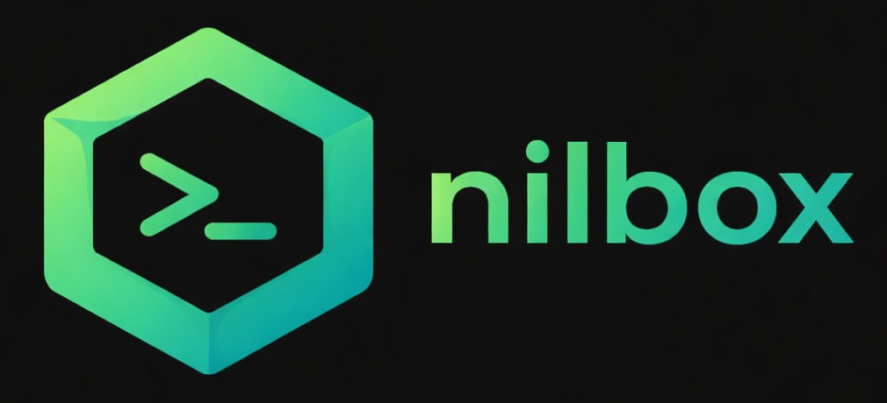
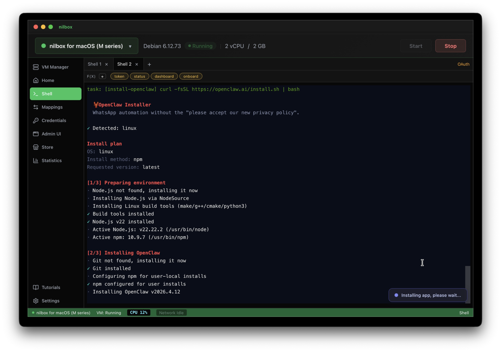

<p align="center">
  
</p>

<p align="center">
  <strong>Desktop sandbox for running AI agents you don't trust — with real VM isolation and zero-token security.</strong>
</p>

<p align="center">
  <a href="#quick-start">Quick Start</a> ·
  <a href="#use-case-openclaw">Use Case</a> ·
  <a href="#how-it-works">How It Works</a> ·
  <a href="#features">Features</a> ·
  <a href="#documentation">Docs</a>
</p>  

<p align="center">
  
  
  
  
  
</p>

---

## Why nilbox?

AI agents need shell access, filesystem access, and outbound API calls. Running them in a container on the host kernel isn't real isolation — especially when those agents handle real credentials.

nilbox takes a different approach:

- **Real VM isolation** — workloads run in a full virtual machine, not a container
- **Zero-token architecture** — API keys never enter the guest; the host proxy swaps tokens in-flight for trusted domains only
- **Host-controlled network** — all outbound traffic routes through VSOCK to a domain-gating proxy with rate limits and approval prompts

If you wouldn't give someone your API keys, don't put those keys where their code runs.

---

## Quick Start

### Download

Grab the latest release for your platform from [GitHub Releases](https://github.com/paiml/nilbox/releases).

### Build from Source

**Prerequisites:** [Rust](https://rustup.rs/) toolchain, [Node.js](https://nodejs.org/) 18+

```bash
git clone https://github.com/paiml/nilbox.git
cd nilbox

# Run the desktop app
cd apps/nilbox && npm install && npm run tauri dev
```

See [Development Guide](docs/development.md) for full build instructions and release builds.

---

## Use Case: OpenClaw

Consider running an autonomous AI coding agent like OpenClaw. It needs API keys for OpenAI, Anthropic, and GitHub — plus shell access to write and execute code. That's a lot of trust.

**Without nilbox** (traditional Docker/host setup):

```bash
# Inside the container — real keys are fully exposed
$ echo $OPENAI_KEY
sk-proj-abc1234567890xyz...    # real token, stealable
```

A single prompt injection or rogue dependency can read these keys, exfiltrate them, and drain your API budget.

**With nilbox:**

```bash
# Inside the VM — only dummy values exist
$ echo $OPENAI_KEY
OPENAI_KEY                     # just a string, useless to attackers
```

**Multi-provider token setup** — configure each provider's environment variables in nilbox. OpenClaw only sees the token names as shown below; the nilbox proxy swaps them for real credentials on trusted domains only:

```
# Claude (Anthropic)
ANTHROPIC_API_KEY=ANTHROPIC_API_KEY

# AWS Bedrock
AWS_ACCESS_KEY_ID=AWS_ACCESS_KEY_ID
AWS_SECRET_ACCESS_KEY=AWS_SECRET_ACCESS_KEY

# Gemini
GEMINI_API_KEY=GEMINI_API_KEY
```

When the agent makes a legitimate API call to `api.openai.com`, the nilbox proxy on the host intercepts it, swaps `OPENAI_KEY` for the real token, and forwards it. When a malicious payload tries to send keys to `attacker.evil.com`, the proxy either blocks the domain outright or sends only the dummy string — **the real token never leaves the host**.

**Zero code changes required.** OpenClaw — or any other agent — runs unmodified inside the VM. It reads environment variables and makes API calls exactly as it would on bare metal. The token swap happens transparently at the host proxy layer, outside the guest. You don't patch your agent, your dependencies, or your scripts.

The result:
- No key rotation after a compromise — real tokens were never exposed
- No bill shock — per-provider spending limits block runaway usage
- No data leaks — the VM can only reach domains you approve

See [Zero Token Architecture](docs/zero-token-architecture.md) for attack scenarios and defense layers.

> **You don't need a Mac Mini to run OpenClaw.** That old laptop sitting at home is all you need — install nilbox and start running AI agents securely today.

---

## How It Works

1. **Start a VM** — the desktop app launches a VM via the platform backend (Apple Virtualization.framework on macOS, QEMU on Linux/Windows).
2. **Guest agent connects** — a Rust agent inside the VM establishes a VSOCK channel back to the host.
3. **AI agent makes an API call** — the request goes through the local outbound proxy (`127.0.0.1:8088`).
4. **Host proxy intercepts** — for trusted domains, the proxy swaps dummy env-var names for real API tokens. For untrusted domains, the dummy value passes through or the request is blocked.
5. **Response flows back** — token usage is extracted and tracked against configurable limits.

---

<p align="center">
  
</p>

---

## Features

### Security & Isolation

- **Encrypted KeyStore** — SQLCipher + OS keyring (macOS Keychain / Linux secret-service / Windows native)
- **Domain Gating** — Allow Once / Allow Always / Deny per domain at runtime
- **DNS Blocklist** — Bloom-filter blocklist for VM outbound traffic
- **Auth Delegation** — Bearer, AWS SigV4, and Rhai-scripted OAuth out of the box

### AI Agent Support

- **MCP Bridge** — Model Context Protocol bridging between host and VM (stdio + SSE)
- **Token Usage Monitoring** — per-provider tracking with configurable limits (warn at 80%, block at 95%)
- **OAuth Script Engine** — pluggable auth via Rhai scripting

### VM Management

- **Multi-VM** — create, start, stop, and monitor multiple VMs
- **Integrated Terminal** — xterm.js shell into running guests via VSOCK PTY
- **Port Mapping** — host-to-VM port forwarding, persisted across restarts
- **SSH Gateway** — host-side SSH access for external tooling
- **File Mapping** — FUSE-over-VSOCK shared directories
- **Disk Resize** — resize VM disk images with auto-expand on boot

### Ecosystem

- **[App Store](https://store.nilbox.run/store)** — one-click install for apps and MCP servers inside the VM. Designed for users who aren't comfortable with Linux — no terminal required. If you're already at home on the command line, you can install anything directly via shell without the store.


---

## Documentation

| Document | What's Covered |
|----------|---------------|
| [Development Guide](docs/development.md) | Project structure, tech stack, platform support, build instructions |
| [Contributing](CONTRIBUTING.md) | Development setup, code guidelines, PR workflow, reporting issues |
| [Zero Token Architecture](docs/zero-token-architecture.md) | Security model details, attack scenarios, defense layers, FAQ |
| [VM Image Scripts](scripts/) | Platform-specific Debian image builders and QEMU binary builds |
| [OAuth Scripts](oauth-scripts/) | Rhai-based OAuth provider definitions for the proxy |
| [MCP Bridge](scripts/mcp/) | Connecting Claude Desktop to VM-hosted MCP servers |
| [Playwright CDP](scripts/playwright-mcp-hello/) | Running Playwright MCP with Chrome CDP over VSOCK |
| [nilbox-vmm](nilbox-vmm/) | macOS VMM using Apple Virtualization.framework (Swift) |
| [nilbox-blocklist](nilbox/crates/nilbox-blocklist/README.md) | Bloom-filter DNS blocklist — build, update, and query blocklists (OISD, URLhaus) |

---

## Contributing

Contributions are welcome! See [CONTRIBUTING.md](CONTRIBUTING.md) for development setup, code guidelines, and PR workflow.

---

## License

GNU General Public License v3.0 — see [LICENSE](LICENSE).

---

<p align="center">
  Built with
  <a href="https://tauri.app/">Tauri</a> ·
  <a href="https://react.dev/">React</a> ·
  <a href="https://github.com/rustls/rustls">rustls</a> ·
  <a href="https://xtermjs.org/">xterm.js</a> ·
  <a href="https://www.zetetic.net/sqlcipher/">SQLCipher</a> ·
  <a href="https://rhai.rs/">Rhai</a>
</p>
