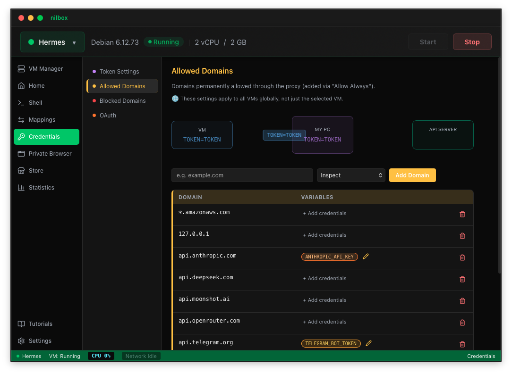
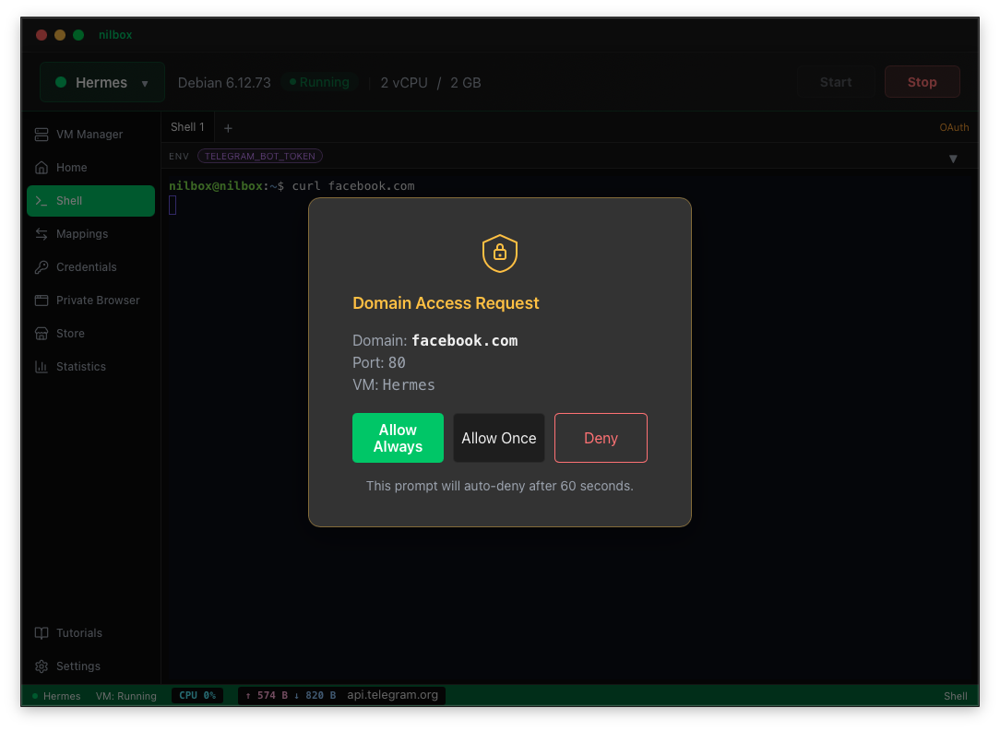

<p align="center">
  
</p>

<p align="center">
  <strong>A desktop sandbox for running AI agents, MCP servers, and apps you don't fully trust — safely.</strong>
</p>

<p align="center">
  Run agents on a dedicated, isolated Linux VM — with real VM isolation and <a href="#zero-token-architecture">Zero Token Architecture</a>, so your API keys never touch the agent.
</p>

<p align="center">
  <a href="#what-is-nilbox">What is nilbox</a> ·
  <a href="#who-nilbox-is-for">Who It's For</a> ·
  <a href="#zero-token-architecture">Zero Token</a> ·
  <a href="#agent-firewall">Agent Firewall</a> ·
  <a href="#what-you-can-run">What You Can Run</a> ·
  <a href="#no-code-changes--just-set-env-vars">No Code Changes</a> ·
  <a href="#quick-start">Quick Start</a> ·
  <a href="#features">Features</a> ·
  <a href="https://docs.nilbox.run/docs/intro/">Docs</a>
</p>

<p align="center">
  
  
  
  
  
</p>

---

## What is nilbox

**nilbox is a desktop app for running AI agents and MCP servers safely.**

It runs agents and MCP servers on a dedicated **Linux VM** that is fully isolated from your host OS, and it blocks token leakage **at the source** with Zero Token Architecture — so your real API keys never touch the agent.

AI agents need shell access, filesystem access, and outbound API calls. Running them in a container on the host kernel isn't real isolation — especially when those agents handle real credentials. nilbox gives every agent a full virtual machine and a host-controlled network instead.

> If you wouldn't hand someone your API keys, don't put those keys where their code runs.

---

## Who nilbox Is For

It helps to know which mental model applies to you.

Most sandbox platforms are **infrastructure you build on**: you're shipping a product that runs *AI-generated* code from many users at scale, so you reach for a server-side platform with SDKs, container orchestration, resource quotas, and multi-tenant scheduling. You write code *against* the sandbox.

**nilbox is the opposite — it's an app you run agents *in*, on the machine in front of you.** You don't build a platform; you point nilbox at an agent you already have and run it safely. Think of it as a personal, secure home for agents rather than cloud infrastructure for a fleet of them.

You'll likely want nilbox if you are:

- **A developer running a coding agent on your own machine** — let OpenClaw, Claude Code, or similar work autonomously (even overnight) without risking your API keys or your host OS.
- **Someone trying AI agents without a terminal** — install agents and MCP servers from the one-click Store; no Linux knowledge required.
- **Security-conscious about what you run** — evaluate untrusted MCP servers, packages, or binaries inside a disposable VM instead of on your real system.
- **Running agents remotely** — drive agents from chat (Telegram, Hermes) while they stay sandboxed at home.

You probably **don't** need nilbox if you're operating a cloud service that spins up thousands of ephemeral sandboxes for many tenants — that's a job for server-side sandbox infrastructure. nilbox is desktop-first and single-operator by design.

---

## Zero Token Architecture

The core idea is simple: **never give the real token to the agent in the first place.**

Instead of asking *"How do we protect the token?"*, nilbox asks *"What if we never give it out at all?"*

**The limit of traditional approaches** — the real token is passed straight to the agent:

```bash
# AI agent environment variable
OPENAI_API_KEY=sk-proj-abc1234567890xyz   # real token — stealable
```

Even inside Docker or a sandbox, a prompt injection or a malicious dependency can read environment variables and exfiltrate the key. There's no way to stop it once the agent holds the real value.

**nilbox's approach** — the agent only ever sees a *fake* token whose name and value are identical:

```bash
# AI agent environment variable
OPENAI_API_KEY=OPENAI_API_KEY             # just a string — useless to attackers
```

The real token lives only on the host, where the agent can never see it.

**Token substitution flow:**

```
┌───────────┐  OPENAI_API_KEY   ┌─────────┐   sk-proj-real   ┌──────────┐
│ AI Agent  │ ────────────────▶ │ nilbox  │ ───────────────▶ │   LLM    │
└───────────┘                   └─────────┘                  └──────────┘
      ▲                                                             │
      │                         response                           │
      └─────────────────────────────────────────────────────────────┘
```

<p align="center">
  
</p>

The moment the agent makes an API call, the nilbox host proxy intercepts the request and swaps the fake token for the real one — but only for trusted domains. The agent believes it holds a real token and gets a normal response.

**Why it's safe even if leaked.** If an attacker extracts the token from the agent's environment, all they get is `OPENAI_API_KEY` — a meaningless string. When malicious code tries to send it to `attacker.evil.com`, the proxy blocks the domain or forwards only the dummy value. **The real token never leaves the host.**

The result:
- **No key rotation after a compromise** — real tokens were never exposed
- **No bill shock** — per-provider spending limits block runaway usage
- **No data leaks** — the VM can only reach domains you approve

See [Zero Token Architecture](docs/zero-token-architecture.md) for attack scenarios and defense layers.

---

## Agent Firewall

An agent inside nilbox has **no direct network**. Every outbound request leaves the VM over VSOCK and passes through a host-side **firewall built for AI agents** — it sits between the agent and the internet, inspects each connection, and gates it against rules you control. The agent can't disable or route around it, because the firewall lives *outside* the guest.

- **Default-deny egress** — the agent reaches only the destinations you allow; everything else is blocked.
- **Domain gating with approval** — on a new destination, nilbox pauses the request and prompts you: **Allow Once / Allow Always / Deny**. Human-in-the-loop for anything unexpected.
- **DNS blocklist** — known-malicious domains (OISD, URLhaus) are dropped automatically via a Bloom-filter blocklist.
- **Credential firewall** — real API keys never cross the boundary; the proxy injects them only for trusted domains (see [Zero Token Architecture](#zero-token-architecture)). A compromised agent can't exfiltrate what it never held.
- **Rate & spend limits** — per-provider token-usage caps (warn at 80%, block at 95%) stop a runaway or hijacked agent from draining your budget.
- **Audit trail** — outbound activity and token usage are tracked, so you can see exactly what the agent tried to reach.

This is **prompt-injection containment in practice**: even if an agent is fully compromised, it can only talk to destinations you approved, carrying dummy credentials, under spending caps — so a leak has nowhere to go.

<p align="center">
  
</p>

---

## What You Can Run

nilbox runs any agent, MCP server, or unknown app — unmodified — inside the VM. A few common setups:

- 🤖 **[OpenClaw](https://docs.nilbox.run/docs/intro/)** — an autonomous AI coding agent that needs OpenAI / Anthropic / GitHub keys plus shell access. Run it with zero exposed keys.
- 🔌 **Claude + MCP** — bridge VM-hosted MCP servers to Claude Desktop over VSOCK ([MCP Bridge](scripts/mcp/)).
- 📡 **Hermes & Telegram** — drive agents remotely via chat integrations.
- 🌐 **Playwright / browser automation** — run Playwright MCP with Chrome CDP over VSOCK ([guide](scripts/playwright-mcp-hello/)).
- 📦 **Any unknown app** — try untrusted binaries and packages without risking your host.

> **You don't need a Mac Mini to run agents.** That old laptop sitting at home is all you need — install nilbox and start running AI agents securely today.

---

## No Code Changes — Just Set Env Vars

**The only thing you configure is environment variables. You never touch the code you run.**

Other sandboxes are libraries: you import an SDK, wrap your logic in its API, and call into it to create a sandbox and execute code. That means the code has to be *yours* to change — and you take on the SDK as a dependency, rewrite your agent against it, and keep both in sync as each updates.

nilbox works the opposite way. Your agent, MCP server, or app runs **completely unmodified** inside the VM. It reads environment variables and makes API calls exactly as it would on bare metal; the token swap and isolation happen transparently at the host proxy layer, *outside* the guest. The only setup is configuring each provider's env vars (e.g. `ANTHROPIC_API_KEY=ANTHROPIC_API_KEY`) — the values are dummy names, and nilbox substitutes the real tokens on trusted domains only.

**Why this matters:**

- **Run code you can't change** — closed-source agents, third-party binaries, and untrusted packages all just work. There's nothing to integrate.
- **No SDK, no lock-in** — you don't rewrite your agent against a vendor API or carry a dependency that must track upstream releases.
- **No maintenance drift** — when the agent updates, nothing on your side breaks; the sandbox boundary lives outside the app.
- **Isolation that doesn't depend on cooperation** — security isn't enforced by the app calling a sandbox API correctly. Even a malicious or buggy app can't opt out of the VM boundary or reach the real tokens.

```
# Multi-provider setup — the agent only ever sees these names, never the real values
ANTHROPIC_API_KEY=ANTHROPIC_API_KEY
AWS_ACCESS_KEY_ID=AWS_ACCESS_KEY_ID
AWS_SECRET_ACCESS_KEY=AWS_SECRET_ACCESS_KEY
GEMINI_API_KEY=GEMINI_API_KEY
```

---

## Quick Start

### Download

Grab the latest release for your platform from [GitHub Releases](https://github.com/paiml/nilbox/releases), install the desktop app, and launch it. On first launch, the managed Linux VM is prepared automatically.

See the [Installation guide](https://docs.nilbox.run/docs/intro/) for step-by-step setup.

### Build from Source

**Prerequisites:** [Rust](https://rustup.rs/) toolchain, [Node.js](https://nodejs.org/) 18+

```bash
git clone https://github.com/paiml/nilbox.git
cd nilbox

# Run the desktop app
cd apps/nilbox && npm install && npm run tauri dev
```

See the [Development Guide](docs/development.md) for full build instructions and release builds.

---

## How It Works

1. **Start a VM** — the desktop app launches a VM via the platform backend (Apple Virtualization.framework on macOS, QEMU on Linux/Windows).
2. **Guest agent connects** — a Rust agent inside the VM establishes a VSOCK channel back to the host.
3. **AI agent makes an API call** — the request goes through the local outbound proxy (`127.0.0.1:8088`).
4. **Host proxy intercepts** — for trusted domains, the proxy swaps dummy env-var names for real API tokens. For untrusted domains, the dummy value passes through or the request is blocked.
5. **Response flows back** — token usage is extracted and tracked against configurable limits.

---

<p align="center">
  
</p>

---

## Features

### Security & Isolation

- **[Agent Firewall](#agent-firewall)** — host-side, default-deny firewall for AI agents; gates every outbound action with allowlists, approval prompts, and audit trail
- **Real VM isolation** — workloads run in a full virtual machine, not a container on the host kernel
- **Zero-token proxy** — real API keys never enter the guest; the host proxy swaps tokens in-flight for trusted domains only
- **Encrypted KeyStore** — SQLCipher + OS keyring (macOS Keychain / Linux secret-service / Windows native)
- **Domain Gating** — Allow Once / Allow Always / Deny per domain at runtime
- **DNS Blocklist** — Bloom-filter blocklist for VM outbound traffic
- **Auth Delegation** — Bearer, AWS SigV4, and Rhai-scripted OAuth out of the box

### AI Agent Support

- **MCP Bridge** — Model Context Protocol bridging between host and VM (stdio + SSE)
- **Token Usage Monitoring** — per-provider tracking with configurable limits (warn at 80%, block at 95%)
- **OAuth Script Engine** — pluggable auth via Rhai scripting

### VM Management

- **Multi-VM** — create, start, stop, and monitor multiple VMs
- **Integrated Terminal** — xterm.js shell into running guests via VSOCK PTY
- **Port Mapping** — host-to-VM port forwarding, persisted across restarts
- **SSH Gateway** — host-side SSH access for external tooling
- **File Mapping** — FUSE-over-VSOCK shared directories
- **Disk Resize** — resize VM disk images with auto-expand on boot

### Ecosystem

- **[App Store](https://store.nilbox.run/store)** — one-click install for apps and MCP servers inside the VM. Designed for users who aren't comfortable with Linux — no terminal required. If you're already at home on the command line, you can install anything directly via shell without the store.

---

## Why a VM, not a container?

Most agent sandboxes are built for the cloud — they run containers on shared cluster infrastructure and lean on the host kernel for isolation. nilbox takes a different position:

- **Real VM, not a shared kernel** — each workload gets a full virtual machine, so a container escape on the host kernel isn't on the table.
- **Your desktop, not a cluster** — nilbox runs on the machine you already own. No Kubernetes, no cloud bill, no infra to operate.
- **Keys that never enter the guest** — Zero Token Architecture means a compromised agent can't leak credentials it never had, rather than relying on egress filtering alone.
- **No SDK to integrate** — sandboxes built as libraries require you to wrap your code in their API. nilbox runs existing code unmodified; the only setup is env vars. See [No Code Changes](#no-code-changes--just-set-env-vars).
- **No terminal required** — the one-click Store lets non-developers install agents and MCP servers safely, while power users still get a full shell.

---

## Documentation

| Document | What's Covered |
|----------|---------------|
| [Documentation Site](https://docs.nilbox.run/docs/intro/) | Introduction, installation, agent setup, and guides (English / 한국어) |
| [Development Guide](docs/development.md) | Project structure, tech stack, platform support, build instructions |
| [Contributing](CONTRIBUTING.md) | Development setup, code guidelines, PR workflow, reporting issues |
| [Zero Token Architecture](docs/zero-token-architecture.md) | Security model details, attack scenarios, defense layers, FAQ |
| [VM Image Scripts](scripts/) | Platform-specific Debian image builders and QEMU binary builds |
| [OAuth Scripts](oauth-scripts/) | Rhai-based OAuth provider definitions for the proxy |
| [MCP Bridge](scripts/mcp/) | Connecting Claude Desktop to VM-hosted MCP servers |
| [Playwright CDP](scripts/playwright-mcp-hello/) | Running Playwright MCP with Chrome CDP over VSOCK |
| [nilbox-vmm](nilbox-vmm/) | macOS VMM using Apple Virtualization.framework (Swift) |
| [nilbox-blocklist](crates/nilbox-blocklist/README.md) | Bloom-filter DNS blocklist — build, update, and query blocklists (OISD, URLhaus) |

---

## Contributing

Contributions are welcome! See [CONTRIBUTING.md](CONTRIBUTING.md) for development setup, code guidelines, and PR workflow.

---

## License

nilbox is **dual-licensed**:

- **Community Edition** — [GNU General Public License v3.0](LICENSE) (GPL-3.0-or-later).
  Free and open source.
- **Commercial License** — for embedding nilbox in a closed-source product or using it
  without GPL copyleft obligations. See [COMMERCIAL-LICENSE.md](COMMERCIAL-LICENSE.md)
  or contact **question@nilbox.run**.

You may use nilbox under **either** license. You only need a commercial license if the
GPL-3.0 terms do not work for your use case; internal use and evaluation are fully
covered by the GPL-3.0.

Contributions are accepted under the [Contributor License Agreement](CLA.md).

---

<p align="center">
  Built with
  <a href="https://tauri.app/">Tauri</a> ·
  <a href="https://react.dev/">React</a> ·
  <a href="https://github.com/rustls/rustls">rustls</a> ·
  <a href="https://xtermjs.org/">xterm.js</a> ·
  <a href="https://www.zetetic.net/sqlcipher/">SQLCipher</a> ·
  <a href="https://rhai.rs/">Rhai</a>
</p>
